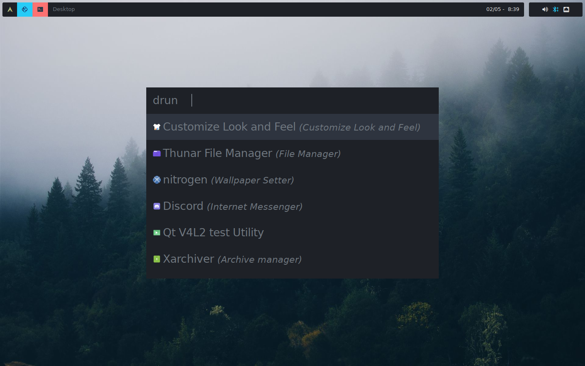

# dots 
A collection of my dot files.
<br>




<br>

## Dependencies

## i3
* Kitty (Terminal)
* Rofi (Application launcher)
* Polybar (Status bar)
* Dunst (Notification Daemon)
* Pcmanfm (File browser)
* Nitrogen (Wallpaper)
* Lxappearance (GTK theme manager)
* Picom (Compositor) 
* w3m (Neofetch backend)
* Xautolock (Lockscreen)
* i3exit (Exit script including blurlock)
* i3-scrot (Screenshot utility)
* Pamixer (Volume control for pulse audio)
* Tela (Icon pack for rofi)
* Flat-Remix-Gtk ( GTK3/4 theme)


```html
sudo pacman -S kitty rofi dunst nitrogen lxappearance-gtk3 xautolock pamixer firefox pcmanfm-gtk3
yay -S polybar picom-jonaburg-git i3-scrot tela-icon-theme flat-remix-gtk i3exit w3m
```

## Software suite
* Firefox (Web browser)
* Brave (Web browser)
* Neovim (Editor)
* l3afpad (Graphical Editor)
* Element (Internet messenger)
* Signal (Internet messenger)
* GPicView (Image viewer)
* Mpv (Media player)
* Zathura (Document viewer)
* Transmission (Torrent client)
* Xarchiver (Archive manager)
* ProtonVPN (VPN)


```html
sudo pacman -S firefox gpicview mpv transmission-gtk neovim
yay -S l3afpad zathura element-desktop signal-desktop zathura-pdf-mupdf brave-bin xarchiver p7zip zip unzip unrar protonvpn-cli-ng
```

## Essential fonts 
* noto-fonts
* ttf-droid
* ttf-dejavu
* ttf-opensans 
* ttf-ubuntu-font-family
* ttf-windows
* ttf-roboto-slab
* ttf-apple-emoji
* ttf-fira-code
* siji-git
* ttf-unifont 
* nerd-fonts-complete

```html
sudo pacman -S noto-fonts ttf-droid ttf-dejavu ttf-opensans ttf-ubuntu-font-family
yay -S ttf-windows ttf-roboto-slab ttf-apple-emoji ttf-fira-code nerd-fonts-complete siji-git ttf-unifont 
```

## Drivers & Devices

* Graphics (Nvidia)

```html
sudo pacman -S nvidia nvidia-utils-openrc
sudo reboot 
nvidia-smi
```

> * Incase you are gaming install this alongside
```html
sudo pacman -S nvidia-dkms nvidia-utils lib32-nvidia-utils nvidia-settings vulkan-icd-loader lib32-vulkan-icd-loader
```


* Intregrated-graphics (Intel)

```html
sudo pacman -S intel-ucode
sudo reboot 
```

* Sound & Bluetooth

```html
sudo pacman -S pulseaudio pulseaudio-alsa pulseaudio-bluetooth alsa-utils pavucontrol
sudo pacman -S bluez bluez-openrc bluez-utils bluez-libs 
yay -S bluez-firmware blueman
pactl set-default-sink 1
sudo rc-update add bluetoothd default
sudo reboot
```

* Wifi 

```html
sudo pacman -S networkmanager networkmanager-openrc network-manager-applet
sudo rc-update NetworkManager add default

```
 
* Printers & Scanners

```html
sudo pacman -S cups cups-openrc
sudo rc-update add cupsd default
sudo pacman -S hplip system-config-printer simple-scan
sudo reboot
```
> * Incase you are dont have a hp printer install the following driver instead of hplip
```html
sudo pacman -S gutenprint
```


* USB Auto-mounting

```html
sudo pacman -S udisks2 udiskie gvfs
sudo rebooot
```


* USB Auto-mounting Android Devices

```html
sudo pacman -S mtpfs gvfs-mtp gvfs-gphoto2
yay -S jmtpfs
sudo rebooot
```
## SWAP File 

```
sudo fallocate -l 8G /swapfile
sudo chmod 600 /swapfile
sudo mkswap /swapfile
echo '/swapfile none swap sw 0 0' | sudo tee -a /etc/fstab
sudo swapon -s
sudo reboot
```

## PATHS

* Bash

```html
export PATH=$PATH:~/.local/bin
```

* Fish 

```html
fish_add_path  ~/.local/bin
```
> * Unlike bash fish doesnt have any fishrc just execute this command.


## Common Issues


## Enable  Arch Linux Support

Artix has reached the stage where it can operate without the help of the Arch repositories, including the preparation of its installation media.
As of now `arch-repos` have been disabled by default. To enable them [view](https://wiki.artixlinux.org/Main/Repositories#Arch_repositories)

```
sudo pacman -S artix-archlinux-support
sudo reboot
sudo pacman -Syyy
```
>* After installing `artix-archlinux-support` follow all the onscreen instructions.

## PGP Keys

Artix sometimes has error recieving keys from the AUR. This issue can be fixed by manually getting the keys from a different server.

```
sudo pacman -Sy gnupg
gpg --recv-keys --keyserver hkp://keyserver.ubuntu.com:80 --recv <Key>
```
> * Here were manually importing the keys from the ubuntu server to fix this problem.

You can also change your keyserver entirely in `/etc/pacman.d/gnupg/gpg.conf`

```
keyserver hkp://keyserver.ubuntu.com/
sudo reboot
sudo pacman -Syyy

```
> * Add this at the end of your `gpg.conf` . If keyserver already exists then change it.

## Debloat 

* Common

```html
sudo pacman -Rns kde-applications
sudo pacman -Rns xfce4 xfce4-goodies
sudo pacman -Rc gnome
sudo pacman -Rc cinnamon-desktop
yay -c
```
> * Some drivers might be uninstalled in the prosecess of debloating. It is advised to reinstall the **Drivers & Devices** once more after debloating. This will be fairly quick as build files for the drivers will be stored in cache

