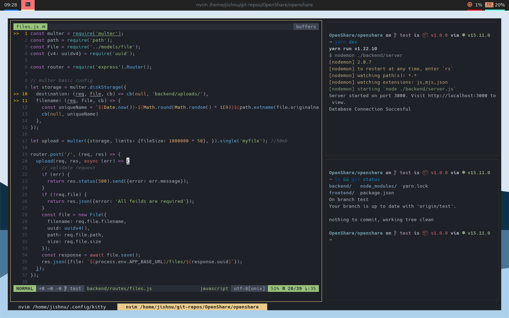

## Kitty

> Kitty is a fast gpu accelerated terminal with a huge number of modern features like support for graphics ,inbuilt multiplexer and many more. However the basic configuration offered in the official website is a mess with a huge documentation. New users may find it difficult to configure so here is a complete and easy to use config.

### How do I use this config 🤔 ?

Once kitty is installed copy the **kitty.conf** contents into your kitty config folder.

>* The config folder is generally located in **~/.config** unless your distro is wierdly configured.
>* Kitty will look for its config in the **.config/kitty/kitty.conf** file. 
>* The config directory is **hidden** by default and you need to create the **kitty folder** in it with the file **kitty.conf**.

  

### This config is huge just tell me how to use the shortcuts 😠 !!

Here are the shortcuts that you will probably be using the most :

#### Window Commands

>* Ctrl+Shift+Enter : *Open a new window (same directory as the parent window)*
>* Ctrl+Shift+W : *Close the focused window*
>* Ctrl+Shift+N : *Open a new instance (same directory as the parent instance )*
>* Ctrl+Shift+Q : *Close the focused instance*

#### Tab Commands
>* Ctrl+Shift+T : *Open a new tab (opens in home directory)*
>* Ctrl+Shift+Q : *Close the focused tab (Closes kitty if no tabs are present)*

#### Other handy shortcuts
>* Ctrl+Shift+Mouse Click : *Opens a url in the configured browser (firefox in this case)*
>* Ctrl+Shift+Equal : *Increase font size*
>* Ctrl+Shift+Minus : *Derease font size*
>* Ctrl+Shift+Backspace : *Restore original font size*

 
Thats it if you need any more help visit the official kitty website. They offer a sample config which might help you.

>* [kitty website](https://sw.kovidgoyal.net/kitty/)

 

## Related Repos 🥳

>* [Kitty Github](https://github.com/kovidgoyal/kitty)
