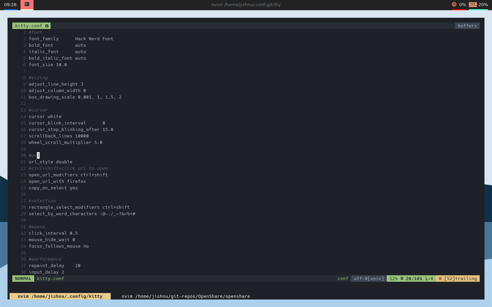

## Basic Instructions

> Kitty is a fast gpu accelerated terminal with a huge number of modern features like support for graphics ,inbuilt multiplexer and many more. However the basic configuration offered in the official website is a mess. New users may find it difficult to configure so here is a complete easy to use config.

