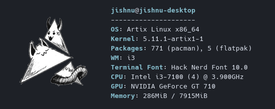

## Neofetch

> Neofetch is a command line tool that displays information about your operating system in a visually pleasing way. 
> The overall purpose of Neofetch is to be used in screen-shots of your system. Neofetch shows the information other people want to see. There are also other tools available for proper system statistic/diagnostics.
> The following config contiains my customized version of neofetch



### How do I use this config 🤔 ?

Once neofetch is installed copy the **config.conf** contents into your neofetch config folder.

>* The config folder is generally located in **~/.config** unless your distro is wierdly configured.
>* Neofetch will look for its config in the **.config/neofetch/config.conf** file. 
>* The config directory is **hidden** by default and you might need to create the **neofetch folder** in it with the file **config.conf**.

<br> 

### Troubles with displaying image 😰 ?
>* Make sure that **w3m** is installed in your system. w3m is essential as it serves as a backend to display the image. 
>* Change the path of the image. The neofetch config provided here contains the path of the image used by me which doesnot exist in your system.

Make sure to change 

``` html
image_source="/home/jishnu/.config/neofetch/artix.png"
```
to 

```html
image_sourcr="/home/your_path"
```
>* The most possible issue might be your terminal cannot display the image properly. If needed change the terminal.
**Urxvt** is among one of the terminals which is really good at handling images with w3m.
If you do not want to switch terminals you can use this.


``` html
image_loop="on"
``` 
> By default this is set to **off** in the config but on setting this on the image is continously rendered in the terminal. This will **fix** the issue but there might be stutterings.

<br>

### I dont want this just give me the cool ascii art 😤 !
>* Just set the image backend to ascii in the config if you want the cool ascii art

``` html
image_backend="ascii"
```
>* This will display the ascii art for your disto

<br>

Thats it if you need any more you should check out the default config. The config is very well documented and has many more features than what has been used here.
